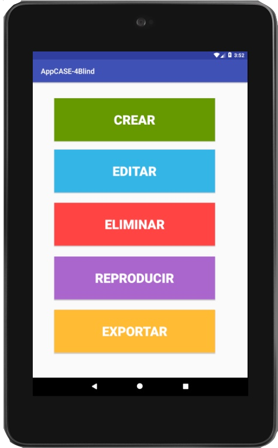
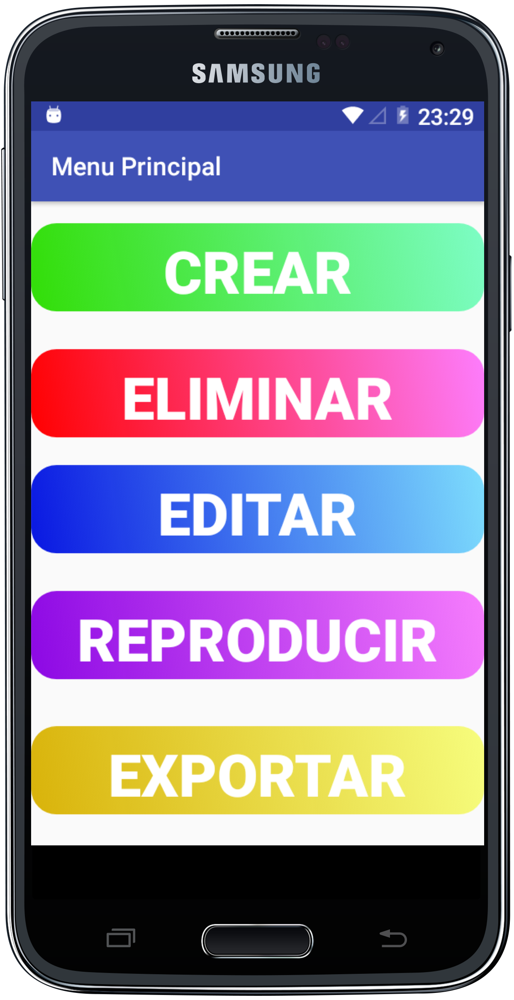

# 
 AppCASE-4Blind  
AppCASE-4Blind V1.0.2018
App native Android.
  
A tool to facilitate the teaching-learning process of Directed Graphs, aimed at blind people.

## Requirements

- Android 5.0 Lollipop (min Sdk Version 19) or greater
- Your favorite IDE

## Get the App for Android 

